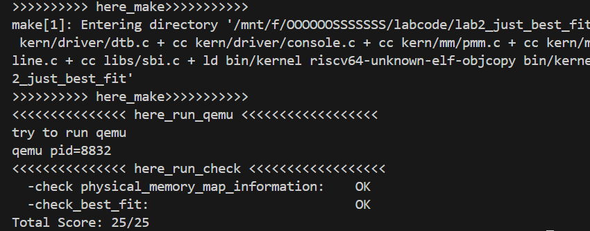

# <center>lab02实验报告</center>
### 任务一

在任务一中我们主要是理解first-fit连续物理内存分配算法的实现过程，分析```default_init```，```default_init_memmap```，```default_alloc_pages```， ```default_free_pages```等相关函数的作用。

**实现过程**

分配实现过程是在空闲块链表中找到第一个符合大小的块，将其分配出去；回收实现过程则是按照块地址在链表中从小到大进行顺序插入，并且在插入之后检查和相邻块是否可以进行合并操作。

**代码分析**

### default_init

```c
default_init(void) {
    list_init(&free_list);//初始化空闲页链表为空链表
    nr_free = 0;//初始化空闲页数为0
}
```

该函数主要进行的是空闲块链表的初始化操作，调用`list_init`函数将空闲页链表初始化为空，然后通过将变量`nr_free`初始化为0表示当前空闲页数为0，下面是list_init函数代码：
```c
list_init(list_entry_t *elm) {
    elm->prev = elm->next = elm;
}
```

### default_init_memmap

```c
static void//这个函数的作用就是初始化一个空闲内存块，然后按照规则将这一内存块的起始地址插入到空闲页链表中表示空闲
default_init_memmap(struct Page *base, size_t n) {//base是内存块的起始地址，n是内存块的页数
    assert(n > 0);//断言页数大于0
    struct Page *p = base;//物理页段的指针
    for (; p != base + n; p ++) {//将该物理页段的每一页初始化
        assert(PageReserved(p));
        p->flags = p->property = 0;
        set_page_ref(p, 0);
    }
    base->property = n;//记录该物理页段的页数
    SetPageProperty(base);//将base页设置为一个空闲块头
    nr_free += n;//此时空闲页的数量增加n
    if (list_empty(&free_list)) {//如果空闲页链表为空就直接将这个空闲页头插入
        list_add(&free_list, &(base->page_link));//意味着freelist中的每一个元素都是代表一段空闲物理页的起始页
    } else {//如果当前空闲页链表不为空，那就让物理页链表按从低地址到高地址的顺序链接
        list_entry_t* le = &free_list;
        while ((le = list_next(le)) != &free_list) {
            struct Page* page = le2page(le, page_link);//将空闲页链表的节点转换为最初的物理页结构，以便于后续进行物理页地址的比较
            if (base < page) {
                list_add_before(le, &(base->page_link));//将小地址的物理页插入到大地址物理页的前面
                break;
            } else if (list_next(le) == &free_list) {
                list_add(le, &(base->page_link));
            }
        }
    }
}

```

该函数的作用就是初始化一个空闲内存块，然后按照将这一内存块的起始地址插入到空闲页链表中表示空闲状态。

首先我们通过`assert`语句来判断页数n是否符合条件，这里要求n必须大于0；

随后通过for循环遍历这一空闲块的每一页，先判定该页面是否为保留页面，如果是的话，就将该页面的flags和property属性统统初始化为0，同时通过`set_page_ref`函数来将当前物理页的引用计数初始化为0：
```c
static inline void set_page_ref(struct Page *page, int val) { page->ref = val; }
```

然后通过`base->property`起始页的property变量来记录这一内存块的页数，将base页设置为一个空闲块头，随后nr_free增加n代表当前空闲页数增加n；

下面就是通过if判断条件来决定内存块插入链表的方式：

- 如果目前空闲块链表为空，那么直接将这个空闲页块的起始页插入链表即可；
- 如果目前空闲块链表非空，那么需要先通过`le2page`函数实现将空闲页链表的节点转换为最初的物理页结构，以便于后续进行物理页地址的比较，然后在while循环中将空闲块按照地址将他放入链表合适的位置上：如果在遍历中找到了比空闲块地址大的节点，那么运用`list_add_before`将空闲块插入到他前面即可；若没有找到则在链表最后运用`list_add`在尾部插入即可。

```c
static inline void
list_add(list_entry_t *listelm, list_entry_t *elm) {
    list_add_after(listelm, elm);
}

static inline void
list_add_before(list_entry_t *listelm, list_entry_t *elm) {
    __list_add(elm, listelm->prev, listelm);
}
```

#### default_alloc_pages

```c
static struct Page *//这个函数的作用就是分配连续n页的物理页，并重新调整空闲页链表
default_alloc_pages(size_t n) {
    assert(n > 0);
    if (n > nr_free) {//如果请求的页数大于空闲页数，直接返回NULL
        return NULL;
    }
    struct Page *page = NULL;
    list_entry_t *le = &free_list;
    while ((le = list_next(le)) != &free_list) {
        struct Page *p = le2page(le, page_link);
        if (p->property >= n) {//找到第一个满足请求，也就是物理页段数量不小于n的空闲块
            page = p;
            break;
        }
    }
    if (page != NULL) {//找到了满足请求的空闲块
        list_entry_t* prev = list_prev(&(page->page_link));
        list_del(&(page->page_link));
        if (page->property > n) {//当找到的物理页的页数量大于请求有剩余的时候
            struct Page *p = page + n;//将前n页视为占用页，从第n+1页开始重新作为一个空闲块
            p->property = page->property - n;
            SetPageProperty(p);
            list_add(prev, &(p->page_link));//重新将剩余的物理页块插入空闲页链表
        }
        nr_free -= n;
        ClearPageProperty(page);
    }
    return page;
}
```

该函数的作用就是分配给定大小的物理页，并重新调整空闲页链表。

首先对请求页数大小进行判断，如果大于目前空闲页数`nr_free`则返回NULL代表无法进行分配；

然后在确定n符合条件之后对空闲页链表进行遍历操作并进行判断，当找到第一个满足请求，也就是物理页段数量不小于n的空闲块，将其赋值给指针`page`，随后对找到的空闲块进行分裂操作：首先将前n页作为分配的结果分配出去，然后当物理页的页数量大于请求，分配完仍有剩余的时候，将剩余的页重新插入到空闲页链表中，同时将property和nr_free的数量都减少n，代表可用空闲页数量减少n。

### default_free_pages

```c
static void//这个函数的作用就是释放一段物理页为空闲状态，并将其重新插入到空闲页链表中，同时进行必要的合并
default_free_pages(struct Page *base, size_t n) {
    assert(n > 0);
    struct Page *p = base;
    for (; p != base + n; p ++) {
        assert(!PageReserved(p) && !PageProperty(p));
        p->flags = 0;
        set_page_ref(p, 0);
    }
    base->property = n;
    SetPageProperty(base);
    nr_free += n;

    if (list_empty(&free_list)) {//这段逻辑和上面的函数一模一样
        list_add(&free_list, &(base->page_link));
    } else {
        list_entry_t* le = &free_list;
        while ((le = list_next(le)) != &free_list) {
            struct Page* page = le2page(le, page_link);
            if (base < page) {
                list_add_before(le, &(base->page_link));
                break;
            } else if (list_next(le) == &free_list) {
                list_add(le, &(base->page_link));
            }
        }
    }

    list_entry_t* le = list_prev(&(base->page_link));
    if (le != &free_list) {
        p = le2page(le, page_link);
        if (p + p->property == base) {//如果前一个节点对应物理页段的最后一页和当前释放的物理页段的起始页相邻，那么将当前页合并到前一页当中
            p->property += base->property;
            ClearPageProperty(base);
            list_del(&(base->page_link));
            base = p;
        }
    }

    le = list_next(&(base->page_link));
    if (le != &free_list) {
        p = le2page(le, page_link);
        if (base + base->property == p) {//如果当前节点对应物理页段的最后一页和后一个释放的物理页段的起始页相邻，那么将后一个页合并到当前页当中
            base->property += p->property;
            ClearPageProperty(p);
            list_del(&(p->page_link));
        }
    }
}
```

该函数的作用就是释放一段物理页为空闲状态，并将其重新插入到空闲页链表中，同时进行必要的合并。

首先，如果该页面的保留属性和页面数量属性均不为初始值了，我们就重置页面的对应属性，将引用设置定义为0。然后对应的更新空闲块数的数量，将页面添加到空闲块链表中，同时尝试合并相邻的空闲块：如果释放的页面与前一个页面或后一个页面相邻，会尝试将它们合并为一个更大的空闲块，将两个块的property进行相加，同时删除当前块，完成合并操作。

### default_nr_free_pages

```c
static size_t
default_nr_free_pages(void) {
    return nr_free;
}

```

该函数的作用是获取当前的空闲页面的数量。

### basic_check
```c
static void
basic_check(void) {
    struct Page *p0, *p1, *p2;
    p0 = p1 = p2 = NULL;
    assert((p0 = alloc_page()) != NULL);
    assert((p1 = alloc_page()) != NULL);
    assert((p2 = alloc_page()) != NULL);

    assert(p0 != p1 && p0 != p2 && p1 != p2);
    assert(page_ref(p0) == 0 && page_ref(p1) == 0 && page_ref(p2) == 0);

    assert(page2pa(p0) < npage * PGSIZE);
    assert(page2pa(p1) < npage * PGSIZE);
    assert(page2pa(p2) < npage * PGSIZE);

    list_entry_t free_list_store = free_list;
    list_init(&free_list);
    assert(list_empty(&free_list));

    unsigned int nr_free_store = nr_free;
    nr_free = 0;

    assert(alloc_page() == NULL);

    free_page(p0);
    free_page(p1);
    free_page(p2);
    assert(nr_free == 3);

    assert((p0 = alloc_page()) != NULL);
    assert((p1 = alloc_page()) != NULL);
    assert((p2 = alloc_page()) != NULL);

    assert(alloc_page() == NULL);

    free_page(p0);
    assert(!list_empty(&free_list));

    struct Page *p;
    assert((p = alloc_page()) == p0);
    assert(alloc_page() == NULL);

    assert(nr_free == 0);
    free_list = free_list_store;
    nr_free = nr_free_store;

    free_page(p);
    free_page(p1);
    free_page(p2);
}

```

这个函数的作用是通过进行对上述函数的调用来进行一些基本的测试，包括页面分配，引用计数，空闲页面的链接操作等。

### default_check

```c
static void
default_check(void) {
    int count = 0, total = 0;
    list_entry_t *le = &free_list;
    while ((le = list_next(le)) != &free_list) {
        struct Page *p = le2page(le, page_link);
        assert(PageProperty(p));
        count ++, total += p->property;
    }
    assert(total == nr_free_pages());

    basic_check();

    struct Page *p0 = alloc_pages(5), *p1, *p2;
    assert(p0 != NULL);
    assert(!PageProperty(p0));

    list_entry_t free_list_store = free_list;
    list_init(&free_list);
    assert(list_empty(&free_list));
    assert(alloc_page() == NULL);

    unsigned int nr_free_store = nr_free;
    nr_free = 0;

    free_pages(p0 + 2, 3);
    assert(alloc_pages(4) == NULL);
    assert(PageProperty(p0 + 2) && p0[2].property == 3);
    assert((p1 = alloc_pages(3)) != NULL);
    assert(alloc_page() == NULL);
    assert(p0 + 2 == p1);

    p2 = p0 + 1;
    free_page(p0);
    free_pages(p1, 3);
    assert(PageProperty(p0) && p0->property == 1);
    assert(PageProperty(p1) && p1->property == 3);

    assert((p0 = alloc_page()) == p2 - 1);
    free_page(p0);
    assert((p0 = alloc_pages(2)) == p2 + 1);

    free_pages(p0, 2);
    free_page(p2);

    assert((p0 = alloc_pages(5)) != NULL);
    assert(alloc_page() == NULL);

    assert(nr_free == 0);
    nr_free = nr_free_store;

    free_list = free_list_store;
    free_pages(p0, 5);

    le = &free_list;
    while ((le = list_next(le)) != &free_list) {
        struct Page *p = le2page(le, page_link);
        count --, total -= p->property;
    }
    assert(count == 0);
    assert(total == 0);
}
```

这个函数就是在上面基本测试函数的基础上进行了更加详细的测试，包括对空闲页面链表的遍历和属性检查、页面分配和释放的各种场景测试。

### 程序在进行物理内存分配的过程以及各个函数的作用

具体分配过程我们都已经在各个函数分析过程中得到理解，在这里进行总结：

- default_init：**初始化空闲内存块链表**，并将空闲块的个数设置为0。
- default_init_memmap：**初始化一个空闲内存块，并插入空闲块链表**先查询空闲内存块的链表，按照地址顺序插入到合适的位置，并将空闲内存块个数加n。
- default_alloc_pages：**分配给定大小的内存块，并对剩余块进行处理**如果剩余空闲内存块大小多于所需的内存区块大小，则将剩余块作为新的空闲块插入链表，并更新该页剩余的大小。
- default_free_pages：**释放内存块，并进行必要的内存块合并**将释放的内存块按照顺序插入到空闲内存块的链表中，并合并与之相邻且连续的空闲内存块。
- default_nr_free_pages：**获取当前的空闲页面的数量。**
- basic_check：**基本功能检测。**
- default_check：**进阶功能检测。**

### 改进空间

* 减少内存碎片，例如尝试启发式策略，在空闲链表中优先选择“碎片化程度较低”的区域，或根据历史分配情况动态调整搜索起点。
* 改进搜索效率，尝试以空闲块大小为键建立平衡树，可在 O(log n) 时间内找到最小可用块。
* 动态调整分配策略，根据系统负载、碎片率或分配模式（短任务/长任务）自动切换为 Best-Fit 或 Next-Fit。
* 改进分配释放算法，将 First-Fit 的灵活性与 Buddy 的快速合并特性结合，实现快速释放与合并。

### 任务二：Best-Fit 连续物理内存分配算法

与First-Fit分配算法不同，Best-Fit会在遍历所有空块，寻找一个最小的大于所要分配的内存的块，也就是找到一个能恰好放入的块，能够在一定程度上减少大块的撕裂，其余逻辑与First-fit相同。在我们的代码里，我们只需要修改 `alloc_pages` 函数中的分配原则即可。

```c
size_t min_size = nr_free + 1;

while ((le = list_next(le)) != &free_list) {
    struct Page *p = le2page(le, page_link);
    if (p->property >= n) {
        
        if(p->property < min_size){
            min_size = p->property;
            page = p;
        }
    }
}
```

在分配内存块时，按照顺序查找对应的空块，同时记录最小块，直至遍历结束所有页。使用 `min_size` 记录最小块的大小，遍历过程更新，结束后，我们自然可以知道最小块所在位置和其对应块的大小。

我们使用 `make grade` 测试如下:



值得一提的是，我们的 `make grade` 中主要测试的是 `satp` 的绝对地址，当我们完成扩展练习后，`.text` 区里在页表前面又塞进了不少内容，完成扩展练习一后，可能由于占据的尚不足一个，物理地址尚未偏移，直至加入slub，我们的物理地址会向后偏移为 `0x80205000` ，继而虚拟地址也会偏移 `0x1000` ，所以我们的 `make grade` 测试应该去掉扩展练习添加内容才能正确执行。同时我们的的slub也是基于偏移后的内容进行的样例添加和测试。

### 扩展练习一：Buddy System 分配算法

本次扩展实现了一个完整可用的伙伴系统物理内存管理器，它将物理内存划分为 2 的幂次大小的块进行管理，以减少外部碎片。

#### 设计文档

**1. 结构设计**

首先设定 `MAX_ORDER` ，我们可以通过直接输出函数 `buddy_init_memmap` 的参数 `n` 来获取最大空闲页数量，可知结果为31930，我们知道2^14是小于该数的最大的2的n次幂，所以我们可以将 `MAX_ORDER` 定为15。

```c
#define MAX_ORDER 15
static free_area_t free_areas[MAX_ORDER];
#define free_list_for_order(order) (free_areas[order].free_list)//
#define nr_free_for_order(order) (free_areas[order].nr_free)

static size_t total_free_pages;//总的空闲页数
static struct Page *buddy_base;//保存最初的base
static size_t buddy_total_pages;//总的纳入buddy算法的页的跨度
```

这里我们根据 `MAX_ORDER` 依次创建了 `free_areas` 的对应数组和起相关方法的宏定义。接着创建了我们的算法（尤其是寻找buddy）中需要用到的几个重要变量。

**2. buddy及memmap的初始化**

```c
static void
buddy_init(void) {
    for (int i = 0; i < MAX_ORDER; i++) {
        list_init(&free_list_for_order(i));
        nr_free_for_order(i) = 0;
    }//初始化整个数组
    total_free_pages = 0;
    buddy_base = NULL;
    buddy_total_pages = 0;//初始化基地址和总页数
}


static void
buddy_init_memmap(struct Page *base, size_t n) {
    assert(n > 0);
    if (buddy_base == NULL) {
        buddy_base = base;
        buddy_total_pages = 0;
    } else {
        assert(base >= buddy_base);
    }//确保是连续内存块

    for (struct Page *p = base; p < base + n; p++) {
        assert(PageReserved(p));
        p->flags = 0;
        p->property = 0;
        set_page_ref(p, 0);
    }//初始化每个Page结构体

    total_free_pages += n;

    size_t base_offset = base - buddy_base;
    //将连续的 n 页划分成若干个不同 order 的块并加入空闲链表
    size_t offset = 0;
    while (offset < n) {
        size_t remaining = n - offset;//剩余页数
        size_t order = 0;
        while (order + 1 < MAX_ORDER) {
            size_t block_size = 1UL << (order + 1);
            if (block_size > remaining) {//不能再更大了
                break;
            }
            size_t global_offset = base_offset + offset;
            if (global_offset & (block_size - 1)) {
                break;
            }//地址未对齐，不能再更大了
            order++;
        }//找到最大的order
        
        struct Page* page = base + offset;//当前块的起始页
        page->property = order;//设置块的order
        SetPageProperty(page);//加入空闲链表
        __free_page(page, order);
        
        offset += (1UL << order);//移动偏移
    }

    size_t new_total = base_offset + n;
    if (new_total > buddy_total_pages) {
        buddy_total_pages = new_total;
    }//更新总页数
}
```

这里我们需要着重讲解memmap的初始化。因为我们知道，一开始初始化的 `n` 并不是一个2的幂的形式。一般的处理思路是简单的把其中最大的、页数是2的幂的部分空间划出，作为buddy system可分配的空间。但这并不是一个合理的处理方式，因为这样会浪费大量内存空间。本次实验就是个很好的例子，`n` 的值为31929，倘若我们只是简单的割出16384大小的空间，会有将近一半的空间被浪费。因此我们采取了一个贪心的策略，通过设置 `remianing` 变量，逐次向下划分空闲块，直至所有空间都被划为空闲块，大大增加了可分配空间。

这也引出了另一个问题，这样真的能实现一个合理的buddy system吗？不会出现合并错误的问题吗？对于一个块来说，当他需要合并时，它需要基于 `buddy_base` ，确定自己到底属于前一个块还是后一个块，换言之，是应该和后一个块结合还是跟前一个块结合。在简单的、由单一最大块分出的buddy system中，这个问题是容易解决的，但我们实现的内容中，这个值得思考，会不会出现合并之后造成和最初的分块完全不同的情况，这不是我们所想见到的。

经过思考与证明，我们采用从大到小排列。在此说明，我们的排列是指，已经按照“剩余空间最大的、页数是2的幂的部分空间划出”进行块的划分后，进行这些块的排列。

先思考按从小到大排列(更一般的是，不完全按照从大到小排列)，就会出现问题：前方的小块会和后面大块中的部分配对，导致整个buddy system一团乱麻。假设整个内存空间为6B，然后进行其中最大的、页数是2的幂的部分空间划出，但是按照从小到大排列，则第一块$block_1$为2B，第二块$block_2$为4B。当4B被分为2B，且其中的第一个块$block_{2,1}$被释放，此时$block_{2,1}$会把$block_1$作为伙伴，此时合并错误。这也是我们选择贪心分配、大块在前的重要原因。

**证明从大到小排列的合理性**:两个块被合并时，在buddy system中一定是前一个块为奇数位，后一个块为偶数位。这里的奇数位和偶数位，是以操作系统管理的物理内存按照$2^k$进行分块排列后得到的每一块的位置。现在按照从大到小排列划分，设定初始化时的空闲块大小为$2^{t_1}$、$2^{t_2}$、$2^{t_3}$······,则$t_1$>$t_2$>$t_3$>······。不会出现相等的情况，因为初始化时都是按照最大的、页数是2的幂的部分空间划出的。假设经过不断的分配和释放操作后，两个$2^{t_i}$的块想要合并，且是错误的合并，假设这两个块中第一个块$block_1$位于初始化时大小为$2^{t_j}$的块内，将$2^{t_1}$、$2^{t_2}$······$2^{t_{j+1}}$的块均按照$2^{t_i}$进行划分，且均会分为2的幂次个$2^{t_i}$的块。此时，$block_1$的所在位置的奇偶性与在$2^{t_j}$的块内的位置的奇偶性相同，而在$2^{t_j}$的块内能够找正确的伙伴块，假设不成立。说明按照从大到小排列进行初始化，不会出现配对错误的情况。

同时这里的对齐检测也是必要的，以便于多次调用 `init_memmap` 后仍可正常执行功能（不过本次实验不会多次调用就是了）。

**3. 占用空闲块**
```c
static struct Page *
buddy_alloc_pages(size_t n) {
    assert(n > 0);
    size_t order = 0;
    while ((1UL << order) < n) {
        order++;
    }//计算需要的最小order

    if (total_free_pages < (1UL << order)) {
        return NULL;
    }//没有足够的页

    size_t current_order;
    for (current_order = order; current_order < MAX_ORDER; current_order++) {
        if (!list_empty(&free_list_for_order(current_order))) {
            break;
        }
    }//找到第一个有空闲块的order

    if (current_order == MAX_ORDER) {
        return NULL;
    }//没有找到合适的块

    list_entry_t* le = list_next(&free_list_for_order(current_order));//取出第一个空闲块
    struct Page* page = le2page(le, page_link);
    list_del(le);//从链表中删除该块
    nr_free_for_order(current_order)--;//减少该order的空闲块计数

    while (current_order > order) {
        current_order--;
        
        // 一个 (current_order + 1) 的块 page，分裂成两个 current_order 的块。
        // 高地址的伙伴块地址 = page 地址 + (1 << current_order)
        struct Page* buddy = page + (1UL << current_order);
        
        // 将高地址的 buddy 块放回空闲链表，并设置正确的 property
        buddy->property = current_order;
        SetPageProperty(buddy);
        __free_page(buddy, current_order);
    }

    ClearPageProperty(page);
    total_free_pages -= (1UL << order);//更新总空闲页数
    return page;
}
```

这部分的逻辑还是相当清晰的。首先计算最小 `order`，在对应的 `free_list` 中寻找对应块，倘若没有则向上遍历，寻找 `order` 更大的快。对于直接找到的块，直接将其在 `free_list` 删除即可；对于向上寻找的到的块，则需将其分裂，直至得到最小 `order`。此时，将位置最低的大小为最小`order`的块删除，其余由大块逐个分割出的小块则放入对应`free_list`。

**4. 释放空闲块**

```c
static struct Page*
get_buddy(struct Page* page, size_t order) {
    if (buddy_base == NULL) {
        return NULL;
    }
    size_t offset = page - buddy_base;//相对base的偏移
    size_t buddy_offset = offset ^ (1UL << order);//取异或找到伙伴
    if (buddy_offset >= buddy_total_pages) {
        return NULL;
    }
    return buddy_base + buddy_offset;//返回伙伴的Page结构体指针
}

static void
__free_page(struct Page* page, size_t order) {
    list_entry_t *le = &free_list_for_order(order);
    while ((le = list_next(le)) != &free_list_for_order(order)) {
        struct Page *p = le2page(le, page_link);
        if (page < p) {
            break;
        }
    }//找到第一个比page大的位置
    list_add_before(le, &(page->page_link));//插入该位置
    nr_free_for_order(order)++;//增加该order的空闲块计数
}

static void
buddy_free_pages(struct Page *base, size_t n) {
    assert(n > 0);
    
    size_t order = 0;
    while ((1UL << order) < n) {
        order++;
    }//计算需要的最小order

    struct Page* page = base;
    total_free_pages += (1UL << order);//更新总空闲页数
    // 在尝试合并之前，必须先将当前块加入空闲链表
    page->property = order;
    SetPageProperty(page);
    __free_page(page, order);

    // 合并循环
    while (order < MAX_ORDER - 1) {
        struct Page* buddy = get_buddy(page, order);
        if (buddy == NULL || !PageProperty(buddy) || buddy->property != order) {
            break; // 找不到空闲的、order 相同的伙伴，停止合并
        }

        // 找到了伙伴，可以合并
        // 先将两个子块从低一级的链表中删除
        list_del(&(page->page_link));
        nr_free_for_order(order)--;
        list_del(&(buddy->page_link));
        nr_free_for_order(order)--;
        ClearPageProperty(page);
        
        ClearPageProperty(buddy);

        if (buddy < page) {
            page = buddy;
        }
        order++;//提升到更高的 order
        
        // 将合并后的大块加入高一级的链表
        page->property = order;
        SetPageProperty(page);
        __free_page(page, order);
    }
}
```

这里我们使用 `get_buddy` 函数获取对应块的伙伴快地址。主要思路是首先获取其对于 `base` 的偏移，接着对其进行`size_t buddy_offset = offset ^ (1UL << order)` 找到其伙伴的偏移。如该偏移和泛，则将其返回。

对于 `buddy_free_pages` 函数，也是类似的计算最小 `order`，然后将其加入链表。接着使用上面的 `get_buddy` 找到伙伴、合并、并向上一层 `order` 递归，直至找不到对应伙伴。

**4. 样例测试**

我们创建了函数 `buddy_dump_free_pages` 和 `buddy_check`，分别用展示空闲页信息和样例测试。首先我们可以观测一下初始状态。

```
------ Buddy System Free Page Dump ------
Order 14 (size 16384), 1 blocks:
  - Block at physical address 0x0000000080346000 (page index 838)
Order 13 (size 8192), 1 blocks:
  - Block at physical address 0x0000000084346000 (page index 17222)
Order 12 (size 4096), 1 blocks:
  - Block at physical address 0x0000000086346000 (page index 25414)
Order 11 (size 2048), 1 blocks:
  - Block at physical address 0x0000000087346000 (page index 29510)
Order 10 (size 1024), 1 blocks:
  - Block at physical address 0x0000000087b46000 (page index 31558)
Order 7 (size 128), 1 blocks:
  - Block at physical address 0x0000000087f46000 (page index 32582)
Order 5 (size 32), 1 blocks:
  - Block at physical address 0x0000000087fc6000 (page index 32710)
Order 4 (size 16), 1 blocks:
  - Block at physical address 0x0000000087fe6000 (page index 32742)
Order 3 (size 8), 1 blocks:
  - Block at physical address 0x0000000087ff6000 (page index 32758)
Order 1 (size 2), 1 blocks:
  - Block at physical address 0x0000000087ffe000 (page index 32766)
Total free pages: 31930
```

可以看到完全按照我们的思路，从空闲块在内存地址上从大到小排列。

我们首先分配一个大小为16383的空间。
```
------ Buddy System Free Page Dump ------
Order 13 (size 8192), 1 blocks:
  - Block at physical address 0x0000000084347000 (page index 17223)
Order 12 (size 4096), 1 blocks:
  - Block at physical address 0x0000000086347000 (page index 25415)
...
```
order为14的块已被分配，我们先释放它。

我们接下来连续分配三个大小为8191的空间。

```
Allocated p1: 8191
------ Buddy System Free Page Dump ------
Order 14 (size 16384), 1 blocks:
  - Block at physical address 0x0000000080347000 (page index 839)
Order 12 (size 4096), 1 blocks:
  - Block at physical address 0x0000000086347000 (page index 25415)
...
```

```
Allocated p2: 8191
------ Buddy System Free Page Dump ------
Order 13 (size 8192), 1 blocks:
  - Block at physical address 0x0000000082347000 (page index 9031)
Order 12 (size 4096), 1 blocks:
  - Block at physical address 0x0000000086347000 (page index 25415)
...
```

```
Allocated p3: 8191
------ Buddy System Free Page Dump ------
Order 12 (size 4096), 1 blocks:
  - Block at physical address 0x0000000086347000 (page index 25415)
...
```

分配完后，我们继续 `assert((p4 = alloc_pages(8191)) == NULL);`。运行过程中没有报错，说明这个也通过了，说明没有可被分配的空间。我们把分配的三个8191释放。

接下来分配一个大小为129的空间，尝试把大小为1024的块分裂。

```
...
Order 9 (size 512), 1 blocks:
  - Block at physical address 0x0000000087d47000 (page index 32071)
Order 8 (size 256), 1 blocks:
  - Block at physical address 0x0000000087c47000 (page index 31815)
...
```

可以看到确实被分裂，而且256的块物理地址小于512的块，完全符合预期。


最后，释放所有分配的内容，看到恢复原状，说明我们成功完成了一个完备的buddy system的功能。


### 扩展练习二：slub 分配算法

SLUB（Simple Allocator）专为小对象设计，通过“按大小分类缓存”和“slab复用”减少内部碎片，提升小对象分配效率。在我们的实现中，页的分配基于buddy_system进行，slub在此基础上负责更小的对象的分配。

#### 设计文档

**1. 宏定义与全局变量**
```c
#define MAX_OBJ_SIZE 1024    // 最大管理对象大小（1KB）
#define MIN_OBJ_SIZE 8       // 最小管理对象大小（8B）
#define PGSIZE 4096          // 物理页大小（4KB）
#define NUM_KMALLOC_CLASSES 8// 小对象大小等级数量（8级）
// 向上对齐宏：将x按a的整数倍对齐
#define ALIGN_UP(x, a) (((x) + ((a)-1)) & ~((a)-1))

// 小对象大小等级（8级）
static size_t kmalloc_sizes[NUM_KMALLOC_CLASSES] = {8,16,32,64,128,256,512,1024};
// 每个大小等级对应的缓存
static struct kmem_cache kmalloc_caches[NUM_KMALLOC_CLASSES];
```

**2. 结构设计**

- **`struct slab`**：管理单个物理页中的小对象，包含空闲对象链表和所属缓存：
  ```c
  struct slab {
      struct kmem_cache *cache;   // 所属的缓存
      struct Page *page;          // 对应的物理页
      size_t inuse;               // 当前使用的对象数量
      struct list_entry free_list;// 空闲对象链表（存储对象地址）
      struct list_entry list_link;// 链入缓存的链表（partial/full）
  };
  ```

- **`struct kmem_cache`**：管理同一大小对象的slab集合，区分部分使用和完全使用的slab：
  ```c
  struct kmem_cache {
      const char *name;           // 缓存名称（未使用）
      size_t obj_size;            // 对象大小（已对齐）
      size_t objs_per_slab;       // 每个slab可容纳的对象数
      struct list_entry slabs_partial; // 部分使用的slab链表
      struct list_entry slabs_full;    // 完全使用的slab链表
  };
  ```

**3. 辅助函数**

**3.1 计算 slab 对象数**
每个slab对应一个物理页，需扣除`struct slab`元数据的空间：
```c
static size_t slab_objs_per_slab(size_t obj_size) {
    size_t usable = PGSIZE - sizeof(struct slab);  // 页内可用空间
    return usable / obj_size;                      // 可容纳的对象数
}
```
**3.2 链表节点转 slab**
通过链表节点地址反向计算对应的`struct slab`地址：
```c
static struct slab *le2slab(struct list_entry *le) {
    return (struct slab*)((char*)le - offsetof(struct slab, list_link));
}
```

**4. 缓存初始化（`slub_init`）**
为每个大小等级创建缓存，计算对齐后的对象大小和每个slab的对象数：
```c
static void slub_init(void) {
    for (int i = 0; i < NUM_KMALLOC_CLASSES; i++) {
        // 按指针大小对齐（避免未对齐访问）
        size_t s = ALIGN_UP(kmalloc_sizes[i], sizeof(void*));
        kmalloc_caches[i].name = NULL;
        kmalloc_caches[i].obj_size = s;
        // 计算每个slab的对象数（扣除slab元数据大小）
        kmalloc_caches[i].objs_per_slab = slab_objs_per_slab(s);
        // 初始化slab链表
        list_init(&kmalloc_caches[i].slabs_partial);
        list_init(&kmalloc_caches[i].slabs_full);
    }
}
```

**5. 对象分配（`__cache_alloc`）**
**5.1 核心逻辑**
1. 快速路径：优先从`slabs_partial`（部分使用的slab）中分配对象，避免创建新slab。
2. 慢路径：若无部分使用的slab，分配新物理页创建slab，初始化空闲对象链表。
3. 状态更新：从slab的空闲链表取对象，若slab满则移至`slabs_full`链表。

**5.2 代码实现**
```c
void *__cache_alloc(struct kmem_cache *cache) {
    struct slab *slab = NULL;

    // 步骤1：优先使用部分使用的slab
    if (!list_empty(&cache->slabs_partial)) {
        slab = le2slab(list_next(&cache->slabs_partial));
    } else {
        // 步骤2：分配新物理页创建slab
        struct Page *page = alloc_pages(1);
        if (!page) return NULL;  // 内存不足

        // 将物理页地址转换为内核虚拟地址，作为slab基地址
        struct slab *ns = (struct slab*)KADDR(page2pa(page));
        ns->cache = cache;       // 关联所属缓存
        ns->page = page;         // 关联物理页
        ns->inuse = 0;           // 初始无使用对象
        list_init(&ns->free_list);// 初始化空闲对象链表

        // 步骤3：划分slab为固定大小的对象，构建空闲链表
        char *obj_base = (char*)ns + sizeof(struct slab);  // 对象起始地址
        for (size_t i = 0; i < cache->objs_per_slab; i++) {
            // 每个对象的地址作为链表节点
            struct list_entry *le = (struct list_entry*)(obj_base + i * cache->obj_size);
            list_add(&ns->free_list, le);  // 加入空闲链表
        }

        // 将新slab加入部分使用链表
        list_add(&cache->slabs_partial, &ns->list_link);
        slab = ns;
    }

    // 步骤4：从slab的空闲链表中取出一个对象（尾插法，取最后一个节点）
    struct list_entry *obj = list_prev(&slab->free_list);
    list_del(obj);  // 从空闲链表删除
    slab->inuse++;  // 更新使用计数

    // 步骤5：若slab满，移至完全使用链表
    if (slab->inuse == cache->objs_per_slab) {
        list_del(&slab->list_link);
        list_add(&cache->slabs_full, &slab->list_link);
    }

    return (void*)obj;  // 返回对象地址
}
```

**6. 对象释放（`__cache_free`）**
**6.1 核心逻辑**
1. 定位slab：通过对象地址按页对齐，找到所属的slab。
2. 回收对象：将对象放回slab的空闲链表，更新使用计数。
3. 状态转换：若slab从满状态变为部分使用，移回`slabs_partial`链表。
4. 空slab处理：若slab无使用对象，根据buddy_system管理的空闲页的数量，如果小于阈值，则释放对应的物理页；否则放入`slabs_partial`链表，等待后续回收。测试时直接进行释放。

**6.2 代码实现**
```c
void __cache_free(struct kmem_cache *cache, void *obj) {
    // 步骤1：按页对齐找到所属slab（slab基地址 = 对象地址 & ~(PGSIZE-1)）
    struct slab *slab = (struct slab*)((uintptr_t)obj & ~(PGSIZE - 1));
    // 步骤2：将对象加入slab的空闲链表
    list_add(&slab->free_list, (struct list_entry*)obj);
    slab->inuse--;  // 更新使用计数

    // 步骤3：若slab从满→部分使用，移至partial链表
    if (slab->inuse + 1 == cache->objs_per_slab) {
        list_del(&slab->list_link);
        list_add(&cache->slabs_partial, &slab->list_link);
    }

    // 步骤4：若slab为空，释放物理页（简化实现，实际可保留复用）
    if (slab->inuse == 0) {
        list_del(&slab->list_link);          // 从缓存链表删除
        free_pages(slab->page, 1);           // 释放物理页

        // 真实实现：加载在slabs_partial上，当内存紧张时才将其释放回物理页。                
        // unsigned threshold =5000
        // if(total_free_pages>threshold){
        //     //将其放入 partial 链表，等未来重用
        //     list_del(&slab->list_link);
        //     list_add(&cache->slabs_partial, &slab->list_link);
        // }
        // else{
        //     list_del(&slab->list_link);
        //     free_pages(slab->page, 1);
        // }
    }
}
```


**7. 对外接口（kmalloc/kfree）**
**7.1 大小等级映射（`size_to_class_index`）**
将用户请求的对象大小映射到对应的缓存等级，避免分配过大对象：
```c
static int size_to_class_index(size_t size) {
    if (size == 0) return -1;
    // 小于最小对象大小，按最小大小处理（避免过小对象）
    if (size <= MIN_OBJ_SIZE) size = MIN_OBJ_SIZE;
    // 找到首个大于等于请求大小的等级
    for (int i = 0; i < NUM_KMALLOC_CLASSES; i++) {
        if (size <= kmalloc_caches[i].obj_size)
            return i;
    }
    // 超过最大大小，按最大等级处理
    return NUM_KMALLOC_CLASSES - 1;
}
```

**7.2 分配接口（`kmalloc_bytes`）**
```c
void *kmalloc_bytes(size_t size) {
    if (size == 0) return NULL;
    int idx = size_to_class_index(size);  // 映射到缓存等级
    return __cache_alloc(&kmalloc_caches[idx]);  // 从对应缓存分配
}
```

**7.3 释放接口（`kfree_bytes`）**
```c
void kfree_bytes(void *ptr) {
    if (!ptr) return;  // 空指针无需处理
    // 找到ptr所属的slab，再从对应缓存释放
    struct slab *sl = (struct slab*)((uintptr_t)ptr & ~(PGSIZE - 1));
    __free_page(sl->cache, ptr);
}
```

**8. 样例测试**

我们设置了6个void*指针变量进行slub分配算法的测试。首先为$p_1$和$p_2$分配128B,$p_3$、$p_4$、$p_5$和$p_6$分配1024B，输出结果为:

```c
p1=0xffffffffc7fff038, p2=0xffffffffc7fff0b8, 
p3=0xffffffffc7ff7038, p4=0xffffffffc7ff7438, 
p5=0xffffffffc7ff7838, p6=0xffffffffc7ff8038
```
我们可以清晰地看到，$p_1$和$p_2$正好差距128B，也就是由128B对应的cache进行对象分配。同时，$p_3$、$p_4$、$p_5$、$p_6$也正好差距1024B，也就是由1024B对应的cache进行对象分配。此外，$p_3$与$p_1$的差距为8×4096B。

由于buddy system分配页的算法，初始化时，管理的情况如下：

```c
···//其他更大的2的幂次的空闲块
Order 3 (size 8), 1 blocks:
  - Block at physical address 0x0000000087ff7000 (page index 32759)
Order 0 (size 1), 1 blocks:
  - Block at physical address 0x0000000087fff000 (page index 32767)
```
首先分配$p_1$和$p_2$时，是从Order 0链表中对应的空闲块分配的，后面分配$p_3$、$p_4$、$p_5$和$p_6$时是从Order 3链表中对应的空闲块分配的。同时Order 3链表的空闲块的大小为8个页，所以$p_3$与$p_1$的差距为8×4096B。以及
$p_6$与$p_3$、$p_4$和$p_5$并不处于一个页，这是因为每一个物理页不仅要存储对象，还要存储slub头信息。所以一个页只能容纳3个1024B的对象。

之后，释放了$p_3$的对象，同时为他分配128B的对象，结果如下：
```c
p1=0xffffffffc7fff038, p2=0xffffffffc7fff0b8, 
p3=0xffffffffc7fff138, p4=0xffffffffc7ff7438, 
p5=0xffffffffc7ff7838, p6=0xffffffffc7ff8038
```

接着，由重新为$p_3$分配1024B的对象，结果如下：
```c
p1=0xffffffffc7fff038, p2=0xffffffffc7fff0b8, 
p3=0xffffffffc7ff7038, p4=0xffffffffc7ff7438, 
p5=0xffffffffc7ff7838, p6=0xffffffffc7ff8038
```
可以看到，$p_3$重新分配给`0xffffffffc7ff7038`地址对应的对象，这也说明之前的释放操作正确完成，否则$p_3$原先对应的物理页不存在空闲的对象，则重新使用另一块空闲块，再交给$cache_{1024}$分配给$p_3$,那时应该紧接着$p_6$为`0xffffffffc7ff8438`。

最后，释放了所有分配的对象。

### 扩展练习三

1. **依托固件接口**：现代硬件（尤其是 x86/ARM 服务器、PC）会在启动阶段由固件（BIOS/UEFI） 提前探测物理内存，并通过标准化接口将内存范围、类型（可用 / 保留 / IO）等信息传递给 OS。OS 无需主动探测，只需解析固件提供的数据即可，这是最安全、高效的方案。
2. **解析硬件配置寄存器**：嵌入式系统（如 ARM Cortex-A/RISC-V 嵌入式芯片）通常没有 BIOS/UEFI，需 OS 直接访问内存控制器（如 DDR 控制器）的配置寄存器，获取内存的基地址、大小等硬件配置信息。这类寄存器的地址和格式由芯片手册明确规定，OS 需按手册编写解析逻辑。
3. **主动内存探测**：若既无固件支持，也无芯片手册（极端场景，如未知定制硬件），OS 需通过主动探测内存地址空间的方式，判断某段地址是否为可用物理内存。核心原理是 “向目标地址写入特定数据，再读取验证；若读写一致且无硬件异常，则该地址属于可用内存”。