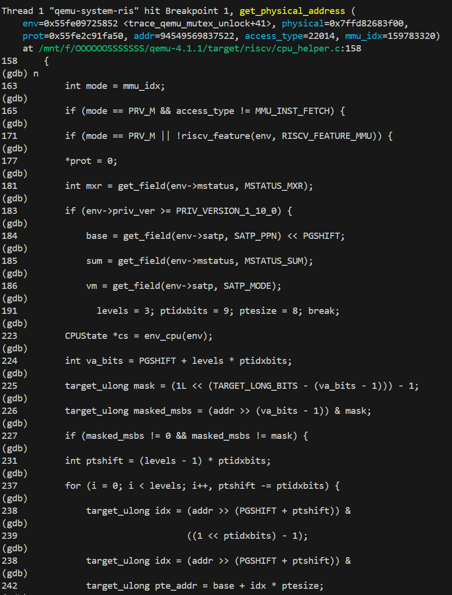
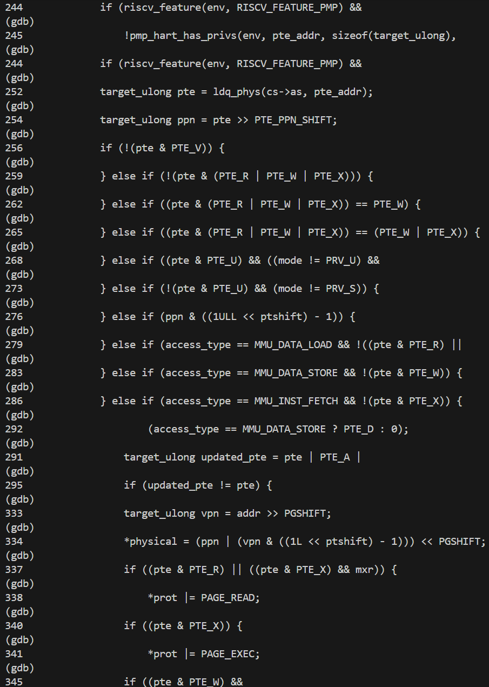
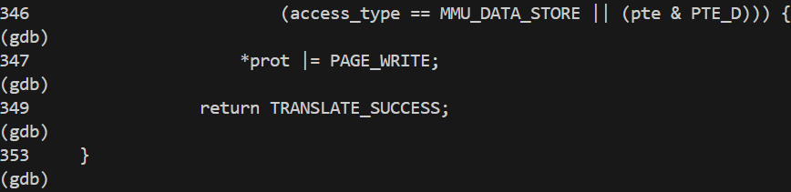
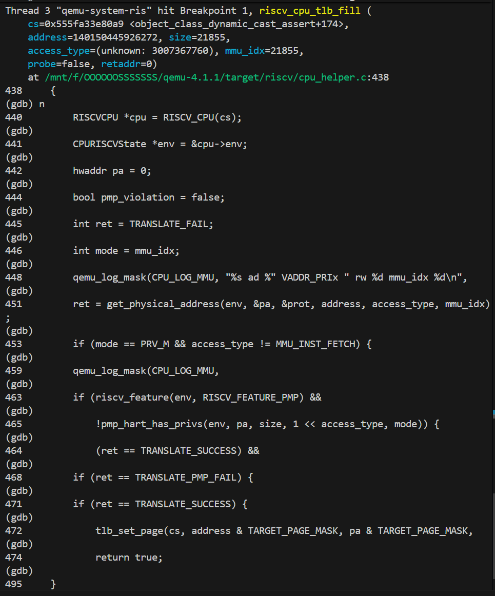
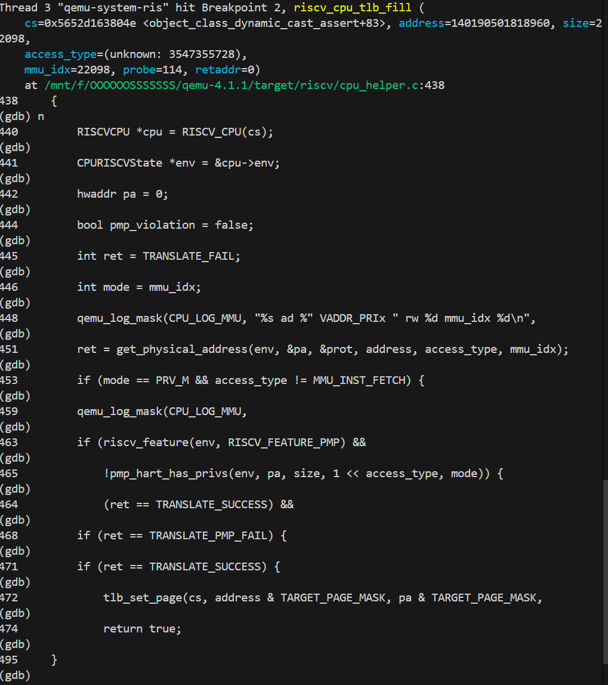
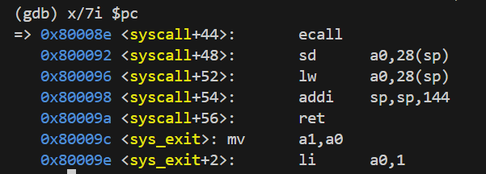
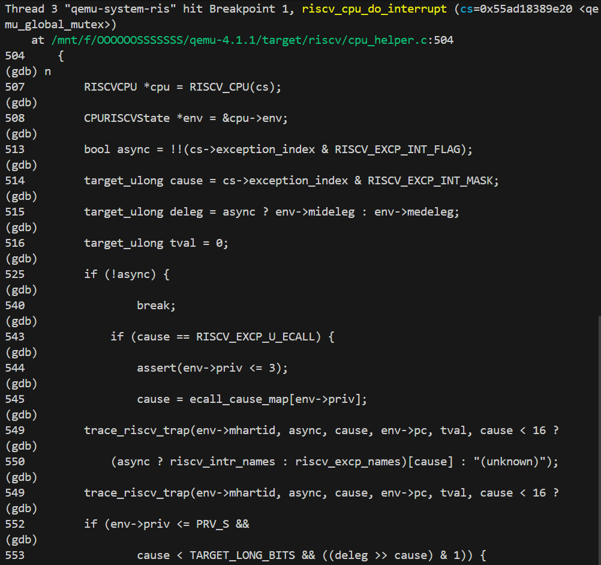
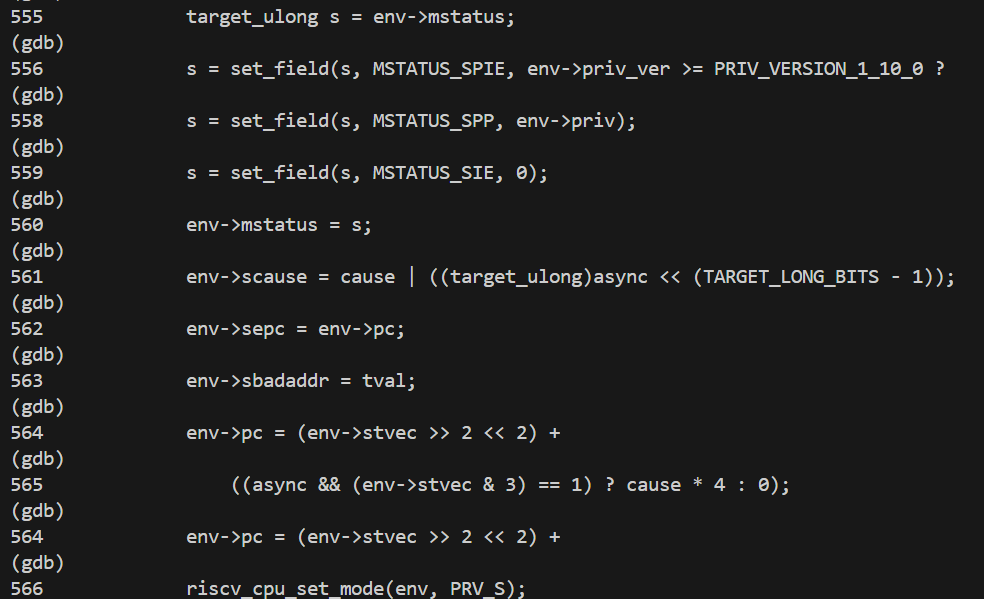
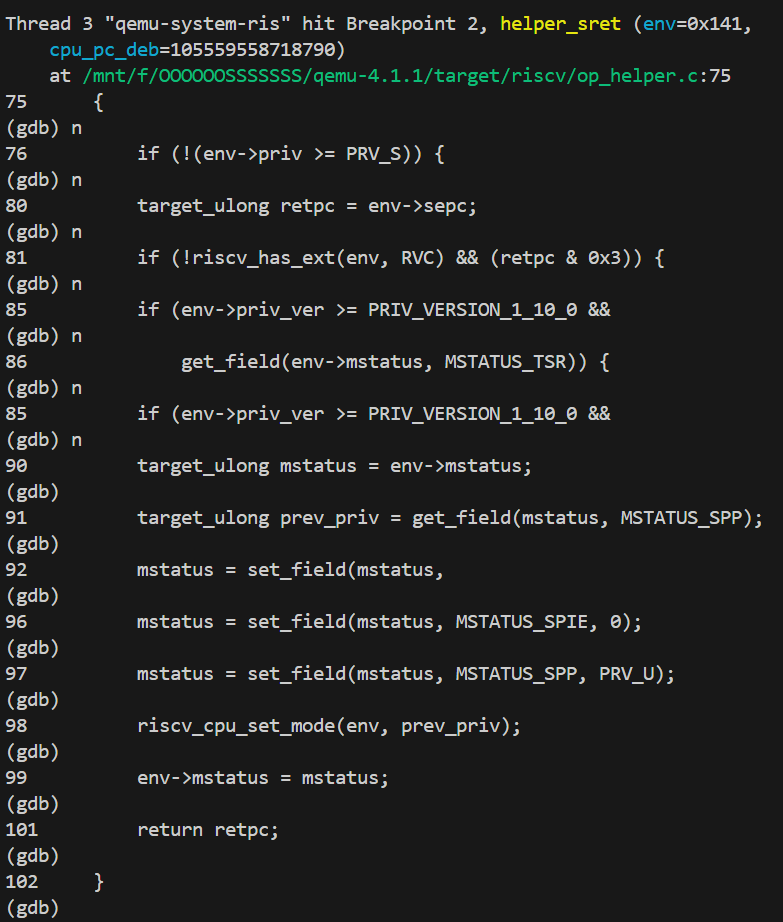

# 操作系统 Lab 5 实验报告

## 练习 0：填写已有实验

本实验依赖于 Lab 2/3/4。在 `kern/process/proc.c` 的 `alloc_proc` 函数中，我们需要初始化进程控制块（PCB）。除了 Lab 4 中初始化的字段（如 `state`, `pid`, `kstack` 等），Lab 5 还需要初始化用于进程管理的字段。

### 代码实现与讲解
在 `alloc_proc` 函数中，我们补充了以下初始化代码：

```c
// Lab 5 新增初始化
proc->wait_state = 0;      // 初始化等待状态，表示当前没有在等待子进程
proc->cptr = NULL;         // 子进程指针初始化为空
proc->optr = NULL;         // 兄弟进程指针初始化为空
proc->yptr = NULL;         // 较年轻的兄弟进程指针初始化为空
```

**讲解**：
这些字段构成了进程树的核心结构：
*   `cptr` (Child Pointer): 指向该进程的第一个子进程。
*   `optr` (Older Sibling Pointer): 指向比该进程创建更早的兄弟进程。
*   `yptr` (Younger Sibling Pointer): 指向比该进程创建更晚的兄弟进程。
这些指针使得内核能够高效地遍历进程家族树，这对于 `do_wait`（回收子进程）和 `do_exit`（父进程退出时接管其子进程）等操作至关重要。

## 练习 1: 加载应用程序并执行

### 1. 设计实现过程 (`load_icode`)

`load_icode` 的主要功能是将 ELF 格式的二进制程序加载到用户空间，并设置好进程的 Trapframe，以便进程返回用户态时能从正确的入口点开始执行。

### 代码实现与讲解

我们需要在 `load_icode` 函数的最后补充设置 Trapframe 的代码：

```c
    //(6) setup trapframe for user environment
    struct trapframe *tf = current->tf;
    // Keep sstatus
    uintptr_t sstatus = tf->status;
    memset(tf, 0, sizeof(struct trapframe));
    
    // 设置用户栈顶
    tf->gpr.sp = USTACKTOP;
    // 设置程序入口地址
    tf->epc = elf->e_entry;
    
    // 设置状态寄存器
    // SSTATUS_SPP = 0: 确保 sret 返回时进入 User Mode (0) 而不是 Supervisor Mode (1)
    // SSTATUS_SPIE = 1: 开启用户态下的中断，允许进程在运行时响应中断
    tf->status = sstatus & ~(SSTATUS_SPP | SSTATUS_SPIE | SSTATUS_SIE);
    tf->status |= SSTATUS_SPIE;
```

**讲解**：
*   **`tf->gpr.sp = USTACKTOP`**: 用户程序在用户态运行时需要栈来保存局部变量和函数调用链。我们在前面的步骤中已经建立了 `[USTACKTOP - USTACKSIZE, USTACKTOP)` 的虚拟内存映射，这里将栈指针 SP 指向栈顶。
*   **`tf->epc = elf->e_entry`**: `epc` (Exception Program Counter) 决定了 `sret` 指令执行后 CPU 跳转的地址。这里将其设置为 ELF Header 中记录的程序入口点。
*   **`tf->status`**: 这是最关键的一步。
    *   清除 `SSTATUS_SPP` 位：SPP (Previous Privilege) 记录了进入 Trap 前的特权级。将其设为 0，意味着 `sret` 后 CPU 将切换到 User Mode。
    *   设置 `SSTATUS_SPIE` 位：SPIE (Previous Interrupt Enable) 记录了进入 Trap 前的中断使能状态。将其设为 1，确保用户程序运行时 CPU 能够响应时钟中断（用于调度）和外部中断。

### 2. 执行流程描述

从 `ucore` 选择该进程占用 CPU 到执行第一条指令的经过：

1.  **调度**：`schedule()` 函数根据调度算法选择该进程（`proc`），调用 `proc_run(proc)`。
2.  **上下文切换**：`proc_run` 调用 `switch_to`，切换 CPU 上下文（寄存器状态）到新进程的内核栈。
3.  **返回用户态准备**：新进程从 `forkret` 开始执行（因为 `context.ra` 指向 `forkret`），调用 `forkrets(current->tf)`。
4.  **恢复中断帧**：`forkrets` 跳转到 `__trapret`（在 `trapentry.S` 中），从 `current->tf` 中恢复通用寄存器和 CSR 寄存器（包括 `sstatus` 和 `sepc`）。
5.  **模式切换**：执行 `sret` 指令。CPU 根据 `sstatus.SPP=0` 切换到用户模式，跳转到 `sepc` 指向的地址（即应用程序入口）。
6.  **执行**：CPU 开始执行应用程序的第一条指令。

## 练习 2: 父进程复制自己的内存空间给子进程

### 1. 设计实现过程 (`do_fork`)

`do_fork` 是创建新进程的核心函数。在 Lab 5 中，它不仅要复制内存和上下文，还需要维护进程树关系（父子、兄弟链表）。

**代码实现与讲解**：

```c
    // 1. 分配并初始化进程控制块 (alloc_proc)
    if ((proc = alloc_proc()) == NULL) {
        goto fork_out;
    }
    proc->parent = current; // 设置父进程
    assert(current->wait_state == 0); // 确保父进程当前没有处于等待状态

    // 2. 分配内核栈 (setup_kstack)
    if (setup_kstack(proc) != 0) {
        goto bad_fork_cleanup_proc;
    }

    // 3. 复制或共享内存空间 (copy_mm)
    // 根据 clone_flags 决定是复制 (dup_mmap) 还是共享 (share)
    if (copy_mm(clone_flags, proc) != 0) {
        goto bad_fork_cleanup_kstack;
    }

    // 4. 设置中断帧和上下文 (copy_thread)
    // 设置子进程的 trapframe 和 context (ra 指向 forkret, sp 指向内核栈顶)
    copy_thread(proc, stack, tf);

    // 5. 插入进程链表和哈希表
    bool intr_flag;
    local_intr_save(intr_flag); // 关中断保证原子性
    {
        proc->pid = get_pid();
        hash_proc(proc);
        set_links(proc); // Lab 5 关键：设置进程树关系 (cptr, yptr, optr)
    }
    local_intr_restore(intr_flag);

    // 6. 唤醒子进程
    wakeup_proc(proc);

    // 7. 返回子进程 PID
    ret = proc->pid;
```

**讲解**：
*   **`assert(current->wait_state == 0)`**: 确保当前进程（父进程）在 fork 子进程时，没有处于等待状态（例如正在等待另一个子进程退出）。这是一个重要的状态检查，防止逻辑错误。
*   **`set_links(proc)`**：这是 Lab 5 中非常重要的一步。它将新进程插入到父进程的子进程链表 (`cptr`) 中，并维护兄弟进程链表 (`optr`, `yptr`)。这确保了操作系统能够正确追踪进程间的关系，从而实现 `wait`（父进程等待子进程退出）和 `exit`（父进程退出时将子进程过继给 init 进程）的功能。

### 2. 设计实现过程 (`copy_range`)

`do_fork` 调用 `copy_mm`，进而调用 `dup_mmap`，最终通过 `copy_range` 复制内存。

### 代码实现与讲解

在 `kern/mm/pmm.c` 的 `copy_range` 函数中，我们实现了内存复制逻辑。这里展示了支持 COW 的改进版本：

```c
            // get page from ptep
            struct Page *page = pte2page(*ptep);
            int ret = 0;
            
            // 如果开启了共享 (COW)
            if (share) {
                // 1. 清除写权限，标记为 COW
                perm = (perm & ~PTE_W) | PTE_COW;
                
                // 2. 重新映射父进程的页表项（更新权限）
                page_insert(from, page, start, perm);
                
                // 3. 映射子进程的页表项（指向同一个物理页）
                ret = page_insert(to, page, start, perm);
            } else {
                // 非 COW 模式：深拷贝
                struct Page *npage = alloc_page();
                assert(page != NULL);
                assert(npage != NULL);
                
                // 获取内核虚拟地址进行内存拷贝
                void *src_kvaddr = page2kva(page);
                void *dst_kvaddr = page2kva(npage);
                memcpy(dst_kvaddr, src_kvaddr, PGSIZE);
                
                // 建立映射
                ret = page_insert(to, npage, start, perm);
            }
```

**讲解**：
*   **非 COW 模式**：这是最基础的实现。父进程有物理页 A，我们为子进程分配物理页 B，然后把 A 的内容完全拷贝给 B。这样父子进程互不干扰，但内存消耗大，拷贝耗时。
*   **COW 模式**：我们不分配新页，而是让子进程的 PTE 也指向物理页 A。关键在于**权限控制**：我们将父子进程对该页的权限都设为**只读** (`~PTE_W`)，并打上 `PTE_COW` 标记。这样，当任一进程试图写入时，CPU 会触发缺页异常，内核就能捕获这个写操作并进行“延迟拷贝”。

### 3. Copy on Write (COW) 机制设计

**概要设计**：
COW 是一种推迟内存复制的优化策略。父子进程在 fork 时不立即复制物理内存，而是共享同一份物理页，并将这些页标记为“只读”。只有当任一进程尝试写入时，才触发缺页异常，进行真正的物理页复制。

**详细设计与实现**：

1.  **标记共享 (`copy_range`)**：
    *   在 `fork` 时，`copy_range` 不分配新页。
    *   将父子进程的 PTE 都指向同一个物理页。
    *   **关键点**：将 PTE 的写权限 (`PTE_W`) 清除，并设置自定义的 `PTE_COW` 标志位（利用 RISC-V PTE 的保留位，如 RSW 位）。
    *   增加物理页的引用计数 (`page_ref_inc`)。

2.  **处理写异常 (`do_pgfault`)**：
    *   当进程尝试写入这些只读页面时，CPU 触发 `Store/AMO Page Fault`。
    *   在 `do_pgfault` 中检测异常原因：如果是写异常且 PTE 中有 `PTE_COW` 标志。
    *   **处理逻辑**：
        *   如果 `page_ref > 1`（共享中）：分配新物理页，拷贝原页内容，将新页映射到当前进程地址，设置 `PTE_W`，清除 `PTE_COW`，原页引用计数减 1。
        *   如果 `page_ref == 1`（独占）：说明其他进程已经释放或拷贝了该页，当前进程直接恢复 `PTE_W`，清除 `PTE_COW` 即可。

## 练习 3: 阅读分析源代码

### 1. fork/exec/wait/exit 分析

*   **fork**：
    *   **执行流程**：用户态调用 `fork()` -> `ecall` -> `trap` -> `sys_fork` -> `do_fork`。
    *   **内核操作**：分配 PCB，分配内核栈，复制内存 (`copy_mm`)，复制上下文 (`copy_thread`)，加入进程链表，唤醒子进程。
    *   **返回**：父进程返回子进程 PID，子进程返回 0（通过修改 `tf->gpr.a0`）。

*   **exec**：
    *   **执行流程**：用户态调用 `exec()` -> ... -> `do_execve`。
    *   **内核操作**：检查文件名，回收当前进程内存 (`exit_mmap`)，加载新程序 (`load_icode`)，设置新 Trapframe。
    *   **返回**：不返回原程序，而是从新程序的入口点开始执行。

*   **wait**：
    *   **执行流程**：用户态调用 `wait()` -> ... -> `do_wait`。
    *   **内核操作**：查找状态为 `ZOMBIE` 的子进程。如果找到，回收其剩余资源（PCB、内核栈），返回 PID。如果子进程还在运行，父进程进入 `SLEEPING` 状态等待。

*   **exit**：
    *   **执行流程**：用户态调用 `exit()` -> ... -> `do_exit`。
    *   **内核操作**：回收页表和内存 (`mm_destroy`)，将状态设为 `ZOMBIE`，唤醒父进程，主动调度 (`schedule`)。

**内核态与用户态交错**：
程序在用户态执行，遇到系统调用或中断时，硬件自动保存现场并跳转到内核态中断处理程序。内核处理完毕后，恢复现场并执行 `sret` 返回用户态。

### 2. 进程生命周期图

```text
      (alloc_proc)          (wakeup_proc)
UNINIT ------------> RUNNABLE <----------> RUNNING
                        ^    (schedule)      |
                        |                    | (do_wait/do_sleep)
                        |                    v
                        +--------------- SLEEPING
                        |
    (do_exit)           |
RUNNING ----------------> ZOMBIE ------------> DEAD
                                (kfree proc)
```

## 扩展练习 Challenge: Copy on Write 实现

### 1. 实现源码说明
我在 `kern/mm/pmm.c` 和 `kern/mm/vmm.c` 中实现了 COW。

**`libs/riscv.h`**:
```c
#define PTE_COW 0x100  // 定义 COW 标志位，使用 RSW (Reserved for Software) 位
```

**`kern/mm/vmm.c` - `do_pgfault`**:
这是 COW 的核心处理逻辑。同时，我们需要确保在处理缺页异常时，根据 VMA 的属性正确设置页表项的权限（特别是执行权限 `PTE_X`）：

```c
    // 根据 VMA 属性设置权限
    uint32_t perm = PTE_U;
    if (vma->vm_flags & VM_WRITE) {
        perm |= (PTE_R | PTE_W);
    }
    if (vma->vm_flags & VM_READ) {
        perm |= PTE_R;
    }
    if (vma->vm_flags & VM_EXEC) {
        perm |= PTE_X; // 关键：确保可执行权限
    }

    // ...

    } else {
        // 检查是否为 COW 页面
        if (*ptep & PTE_COW) {
            struct Page *page = pte2page(*ptep);
            // 如果引用计数 > 1，说明还有其他进程共享此页
            if (page_ref(page) > 1) {
                struct Page *npage = alloc_page(); // 分配新页
                if (npage == NULL) {
                    goto failed;
                }
                // 复制内容
                memcpy(page2kva(npage), page2kva(page), PGSIZE);
                // 建立新映射：可写，无 COW 标志
                if (page_insert(mm->pgdir, npage, addr, perm) != 0) {
                    free_page(npage);
                    goto failed;
                }
            } else {
                // 如果引用计数 == 1，说明只剩当前进程在使用，直接恢复写权限
                *ptep &= ~PTE_COW;
                *ptep |= PTE_W;
                tlb_invalidate(mm->pgdir, addr); // 刷新 TLB
            }
        } else {
            cprintf("ptep is %x, but no swap support, failed\n",*ptep);
            goto failed;
        }
   }
```

解释一下我们实现的COW机制：
1.  在 `do_pgfault` 中，如果发现页表项的 `PTE_COW` 标志位被设置，说明该页是 COW 页面。
2.  如果引用计数大于 1，说明有其他进程共享该页，我们分配一个新的物理页，并将原页的内容拷贝到新页，然后建立新的页表项。可以看到我们的操作并没有清除 `PTE_COW` 标志位，这是因为我们并不需要修改多个进程指向的那个物理页，只需要将目前写的那个进程重新分配一个新的物理页即可。同时，ucore代码框架中，在`page_insert()`函数中会进行判断，如果新页与旧页不同，会调用`page_remove_pte()`函数，这里会进行引用计数的更新。
3.  如果引用计数等于 1，说明只有当前进程在使用该页，我们直接恢复 `PTE_W` 标志位，清除 `PTE_COW` 标志位，刷新 TLB。

**注意**：在 `do_pgfault` 中，必须根据 `vma->vm_flags` 正确设置 `perm`。如果忽略了 `VM_EXEC` 到 `PTE_X` 的映射，那么当程序尝试执行该页面上的指令时，会再次触发 Instruction Page Fault，导致死循环。这是 Lab 5 中容易被忽视的一个细节。

### 2. Dirty COW 漏洞分析
**Dirty COW (CVE-2016-5195)** 是 Linux 内核的一个竞争条件漏洞。
*   **原理**：COW 的过程通常是：(1) 检查页是否共享 -> (2) 如果共享，分配新页并复制 -> (3) 替换页表项。
*   **漏洞点**：在多线程环境下，如果步骤 (1) 和 (3) 之间，另一个线程通过 `madvise(MADV_DONTNEED)` 丢弃了该页的映射，导致步骤 (3) 写入时重新从磁盘加载（或重新获取）了**原始的只读页**，并且错误地赋予了写权限。这使得攻击者可以修改只读文件（如 `/etc/passwd`）。
*   **ucore 中的模拟**：在当前的 ucore Lab 5 环境中，由于是单核且内核不可抢占（大部分时间），很难直接复现这种竞争条件。要模拟它，需要在 `do_pgfault` 的关键路径（检查 COW 和写入页表之间）人为插入延时或调度点，并构造并发线程尝试修改内存映射。

## 问题回答：用户程序预加载

**问题**：该用户程序是何时被预先加载到内存中的？与我们常用操作系统的加载有何区别，原因是什么？

**回答**：
1.  **何时加载**：
    在 Lab 5 中，用户程序（如 `spin`, `exit`）是在**编译内核时**直接链接到内核镜像（Kernel Image）中的。通过宏 `KERNEL_EXECVE`，利用链接器生成的符号（如 `_binary_obj___user_spin_out_start`）直接获取程序在内核数据段中的起始地址和大小，然后通过 `load_icode` 拷贝到新进程的内存空间。因此，它们在**系统启动时**就已经随内核一起加载到物理内存中了。

2.  **与常用 OS 的区别**：
    *   **常用 OS**：用户程序存储在磁盘的文件系统中。当执行 `exec` 时，操作系统通过文件系统驱动从磁盘读取 ELF 文件头，按需将代码段和数据段读入内存（通常结合缺页中断机制）。
    *   **ucore Lab 5**：没有完整的文件系统支持，程序作为静态数据“内嵌”在内核里。

3.  **原因**：
    这是为了简化实验难度。在 Lab 5 阶段，我们主要关注进程管理和虚拟内存，尚未实现完善的文件系统（这是 Lab 8 的内容）。将程序直接链接进内核可以避免处理复杂的磁盘 I/O 和文件系统接口。


## gdb 调试页表查询过程

### QEMU 内存访问与地址翻译分析

为了进一步探究 QEMU 是如何模拟 RISC-V 的 MMU（内存管理单元）功能的，我们尝试追踪了一次内存访问指令（如 `ld`）在 QEMU 源码中的执行路径，观察虚拟地址是如何被翻译为物理地址的。

#### 关键调用路径

当 Guest OS (ucore) 执行一条访存指令时，如果发生了 TLB Miss（或者在 SoftMMU 模式下），QEMU 会触发一系列函数调用来完成地址翻译。核心路径如下：

1.  **`tlb_fill`**: 当 TCG 生成的代码尝试访问内存但 TLB 中没有缓存该页面的映射时，会调用此函数。
2.  **`riscv_cpu_tlb_fill`**: RISC-V 架构特定的 TLB 填充函数。它负责调用底层的翻译逻辑，并根据翻译结果填充 QEMU 的软件 TLB 或触发异常（如 Page Fault）。
3.  **`get_physical_address`**: **这是核心函数**。它模拟了硬件 Page Walker 的行为，遍历页表以查找虚拟地址对应的物理地址。

#### `get_physical_address` 的关键逻辑

在 `target/riscv/cpu_helper.c` 中，`get_physical_address` 函数包含了页表遍历的具体实现。关键的分支语句包括：

*   **模式检查**:
    ```c
    if (mode == PRV_M && access_type != MMU_INST_FETCH) {
        // M 模式下通常直接使用物理地址（除非配置了 PMP 等）
        ...
    }
    ```
*   **Sv32/Sv39/Sv48 分支**:
    根据 `env->satp` (Supervisor Address Translation and Protection) 寄存器的模式字段，决定使用哪种页表格式。
    ```c
    switch (mode) {
    case VM_1_10_SV32:
        levels = 2; ptidxbits = 10; ptesize = 4; break;
    case VM_1_10_SV39:
        levels = 3; ptidxbits = 9; ptesize = 8; break;
    ...
    }
    ```
*   **页表遍历循环**:
    ```c
    for (i = 0; i < levels; i++) {
        // 1. 从物理内存读取 PTE (Page Table Entry)
        // 2. 检查 PTE 有效位 (PTE_V) 和权限位 (PTE_R/W/X)
        // 3. 如果是叶子节点，计算最终物理地址并退出
        // 4. 如果是中间节点，更新基址继续下一级查找
    }
    ```

#### 调试演示：虚拟地址到物理地址的翻译

为了验证这一过程，我们在 QEMU GDB (Terminal 2) 中对 `get_physical_address` 打断点，并观察一次 `ld` 指令的执行。


```gdb
b get_physical_address
```

通过 `n` (next) 指令，我们进行了下面的分析。

#### 调试实录：`get_physical_address` 参数分析

在调试过程中，我们捕获到了如下的断点信息：

```text
Thread 1 "qemu-system-ris" hit Breakpoint 2, get_physical_address (env=0x563021859690, 
    physical=0x7ffdbd3959a0, prot=0x56302175ca50, 
    addr=94764070734290, access_type=22063, 
    mmu_idx=-87684712)
    at /mnt/f/OOOOOOSSSSSSS/qemu-4.1.1/target/riscv/cpu_helper.c:158
```

**参数解读**：
*   **`env`**: 指向当前 CPU 状态的指针，包含了 `satp` 等关键寄存器。
*   **`addr`**: `94764070734290` (即十六进制 `0x5630218599D2`)。这是 CPU 想要访问的**虚拟地址**。
*   **`access_type`**: 指示访问类型（读、写或取指）。
*   **`mmu_idx`**: 指示当前的 MMU 模式（例如 User Mode 或 Supervisor Mode）。

#### 调试实录：Sv39 页表转换过程分析

经过跟大模型的交互，我发现前面进行的捕获并不是一个期望的捕获，这是一个没有进入 `ucore` 的调用，并不是我们想分析的，于是我尝试使用

```
b do_execve
```
直接进入用户态访问，之后再打入 `get_physical_address`，获取到了一个理想的内存访问

我们成功捕获了一次开启了分页模式（Sv39）的内存访问。这次调试展示了完整的页表翻译流程，比之前的 Bare Mode 更有代表性。





**1. 初始化与模式识别**
```c
184             base = get_field(env->satp, SATP_PPN) << PGSHIFT;
186             vm = get_field(env->satp, SATP_MODE);
191               levels = 3; ptidxbits = 9; ptesize = 8; break;
```
*   **`base`**: 从 `satp` 寄存器获取根页表的物理基地址。
*   **`levels = 3`**: 代码识别出 `satp` 的模式为 Sv39，因此设置 `levels = 3`，表示三级页表。

**2. 页表遍历 (Page Walk)**
```c
237         for (i = 0; i < levels; i++, ptshift -= ptidxbits) {
238             target_ulong idx = (addr >> (PGSHIFT + ptshift)) & ((1 << ptidxbits) - 1);
242             target_ulong pte_addr = base + idx * ptesize;
252             target_ulong pte = ldq_phys(cs->as, pte_addr);
```
*   **`idx`**: 从虚拟地址 `addr` 中提取当前级页表的索引（VPN）。
*   **`pte_addr`**: 计算页表项 (PTE) 的物理地址。
*   **`ldq_phys`**: 模拟硬件访问物理内存，读取 PTE。这是 QEMU 模拟 MMU 的核心动作。

**3. PTE 有效性与权限检查**
```c
256             if (!(pte & PTE_V)) { ... }
259             } else if (!(pte & (PTE_R | PTE_W | PTE_X))) { ... }
```
*   **256行**: 检查 PTE 的 V 位（Valid）。如果无效，将触发 Page Fault。
*   **259行**: 检查 R/W/X 位。
    *   如果 `R=0, W=0, X=0`，表示这是指向下一级页表的指针（非叶子节点），循环将继续。
    *   如果任一位为 1，表示这是叶子节点（物理页），循环将结束，进入物理地址计算。
*   在本次调试中，代码跳过了 259 行的 `if` 块，说明找到了叶子节点。

**4. 物理地址生成与权限设置**
```c
334                 *physical = (ppn | (vpn & ((1L << ptshift) - 1))) << PGSHIFT;
337                 if ((pte & PTE_R) || ((pte & PTE_X) && mxr)) {
338                     *prot |= PAGE_READ;
...
349                 return TRANSLATE_SUCCESS;
```
*   `physical`: 将 PTE 中的 PPN（物理页号）与虚拟地址中的页内偏移组合，生成最终的物理地址。
*   `prot`:根据 PTE 的权限位设置 QEMU 的内部权限标志（PAGE_READ/WRITE/EXEC）。
*   `TRANSLATE_SUCCESS`: 翻译成功，CPU 可以继续访问内存。

这次调试完美展示了 Sv39 分页机制在 QEMU 源码层面的实现：从 `satp` 读取根节点，逐级查找 PTE，最后拼接物理地址。

#### 深入探究：QEMU 的软件 TLB 机制

为了更深入地理解 QEMU 的内存模拟机制，我们探究了 QEMU 是如何模拟 TLB (Translation Lookaside Buffer) 的。

**1. QEMU TLB 的实现位置**
通过源码搜索，我们发现 QEMU 的 TLB 模拟逻辑主要位于 `accel/tcg/cputlb.c` 文件中。虽然 QEMU 为了性能会将 TLB 查找编译为宿主机汇编指令（TCG Fast Path），但在 TLB Miss 时，会回退到 C 语言实现的 Slow Path，即 `tlb_fill` 函数。

**2. 调试对比：Bare Mode 下的 TLB 行为**
我们设计了一个实验来验证 QEMU 软件 TLB 与真实硬件 TLB 的区别。
*   **真实硬件**：在 Bare Mode (MMU 关闭) 下，CPU 通常会旁路 (Bypass) TLB，直接访问物理地址。
*   **QEMU 模拟**：我们重启 QEMU（处于 Bare Mode），并拦截 `riscv_cpu_tlb_fill` 函数。

**调试日志分析**：



**现象解读**：
1.  即使在 Bare Mode 下，QEMU 依然调用了 `riscv_cpu_tlb_fill`。
2.  `get_physical_address` 返回了 `TRANSLATE_SUCCESS`（此时执行的是直通映射逻辑，`pa = address`）。
3.  关键在于 **Line 472 `tlb_set_page`**：QEMU 将这个“虚拟地址 = 物理地址”的映射关系也填入了软件 TLB 中。

**3. 调试对比：Sv39 Mode 下的 TLB 行为**
为了形成对比，我们让 ucore 运行至用户态（开启 Sv39 分页），依旧使用和刚刚类似的trick
```
b  do_execve
```
再次拦截 `riscv_cpu_tlb_fill`。

**调试日志分析**：



**现象解读**：
1.  **流程一致性**：即使在开启分页的 Sv39 模式下，QEMU 的处理流程与 Bare Mode **惊人地一致**。
2.  **差异点**：唯一的区别在于 `get_physical_address` 内部。在 Sv39 模式下，该函数执行了复杂的页表遍历（如 4.5 节所示），计算出了物理地址 `pa`。
3.  **殊途同归**：无论物理地址是如何计算出来的（直通还是查表），最终都会通过 `tlb_set_page` 填入软件 TLB。

**4. 总结：QEMU 的 TLB 设计哲学**
通过这两次调试对比，我们深刻理解了 QEMU 的设计：
*   **统一的缓存机制**：QEMU 不区分“直通”还是“映射”，它将所有地址转换结果都视为 TLB 表项。
*   **性能优化**：这种设计使得 TCG 生成的代码（Fast Path）只需要查找 TLB 即可，无需关心当前的 MMU 模式。只有当 TLB Miss 时，才进入 Slow Path (`tlb_fill`) 去处理具体的硬件细节（Bare/Sv39/Sv48 等）。
*   **软硬差异**：这与真实硬件有本质不同。真实硬件在 Bare Mode 下没有 TLB 参与，而在 QEMU 中，TLB 是模拟内存访问的基石。

#### 抓马细节、大模型交互与知识获取

主要遇到的问题就是在进行内存转换分析的时候，简单的使用 `b get_physical_address` 并不能得到一个期望的结果，而未进入 `ucore` 前我不可能一个一个的通过 `c` 去找到对应结果，一方面前面对应断点太多，另一方面我也难以确定何时正式进入，通过询问大模型，他给我提供了一个小trick，通过直接给用户态的进入打点，直接进入具体的 `sv39` 的分页分析，这让我受益匪浅，为我使用gdb调试提供了很好的思路与学习方向。 


## gdb 调试系统调用以及返回

为了深入理解 RISC-V 硬件如何处理特权级切换，我们使用 Dual-GDB（一个 GDB 调试 QEMU 自身，另一个 GDB 调试 ucore 内核）观察了 `ecall` 与 `sret` 指令在 QEMU 源码层面的执行过程。

### 1. ecall 指令的处理 (User -> Kernel)

我们首先需要在终端3使用如下语句：

```
add-symbol-file obj/__user_exit.out
break user/libs/syscall.c:18
```


**解释**：
*   `add-symbol-file obj/__user_exit.out`：让 GDB 加载用户程序 `exit` 的符号表。因为 GDB 启动时默认只加载了内核符号，不加载此文件就无法在用户代码中打断点。
*   `break user/libs/syscall.c:18`：在用户库函数 `syscall` 的第 18 行打断点。这一行正是执行 `ecall` 指令的位置，在此处暂停可以让我们观察从用户态进入内核态前的 CPU 状态。

**源码分析 (`user/libs/syscall.c`)**:
```c
// user/libs/syscall.c
asm volatile (
    "ld a0, %1\n"  // 加载系统调用号
    "ld a1, %2\n"  // 加载参数
    ...
    "ecall\n"      // <--- 触发同步异常，陷入内核
    ...
);
```

现在只是进入内联汇编部分，前面还有好多句ld指令，我们通过输入`si`来直接找到对应的部分，输入：

```
x/7i $pc
```
得到如下结果：


通过询问大模型，我知道了，当用户程序执行 `ecall` 指令发起系统调用时，QEMU 的 `riscv_cpu_do_interrupt` 函数被触发，故在终端2上，使用如下语句打上断点。

```
b riscv_cpu_do_interrupt
```

之后我们输入n逐步观察代码如下：



这就是整个riscv_cpu_do_interrupt的流程。


**关键代码分析 (`target/riscv/cpu_helper.c`)**:
```c
// 1. 确认异常原因
if (cause == RISC_EXCP_U_ECALL) {
    // 2. 委托检查 (Delegation)
    // 检查该异常是否被委托给 S 模式处理 (medeleg 寄存器)
    // 如果没有委托，则由 M 模式处理；如果委托了，则由 S 模式处理
}

// 3. 状态保存与切换
if (env->priv <= PRV_S && cause < TARGET_LONG_BITS && ((deleg >> cause) & 1)) {
    // 处理委托给 S 模式的异常
    target_ulong s = env->mstatus;
    // 保存当前中断使能状态 (SIE -> SPIE)
    s = set_field(s, MSTATUS_SPIE, env->priv_ver >= PRIV_VERSION_1_10_0 ? 
        get_field(s, MSTATUS_SIE) : get_field(s, MSTATUS_UIE << env->priv));
    // 保存当前特权级 (Privilege -> SPP)
    s = set_field(s, MSTATUS_SPP, env->priv);
    // 关闭中断 (SIE = 0)
    s = set_field(s, MSTATUS_SIE, 0);
    env->mstatus = s;
    
    // 保存异常 PC 到 sepc
    env->sepc = env->pc;
    // 保存异常原因到 scause
    env->scause = cause | ((target_ulong)async << (TARGET_LONG_BITS - 1));
    // 切换 PC 到 stvec (内核中断入口)
    env->pc = (env->stvec >> 2 << 2) + ((async && (env->stvec & 3) == 1) ? cause * 4 : 0);
    // 切换特权级到 Supervisor Mode


    riscv_cpu_set_mode(env, PRV_S);
}
```

在gdb调试中，我们看到了 QEMU 处理异常的现场。结合 `target/riscv/cpu_helper.c` 的源码，可以清晰地看到硬件（模拟器）是如何一步步“伪造”出中断现场的：
1.  **委托机制 (Delegation)**：代码中的 `if (env->priv <= PRV_S ...)` 判断逻辑，实际上是在模拟硬件检查 `medeleg` 寄存器。因为 `ecall` 是用户态发起的，通常被委托给 S 模式处理。这解释了为什么我们在 ucore 中能捕获到这个异常，而不是直接被 M 模式的 OpenSBI 拦截。
2.  **上下文保存 (Context Saving)**：截图中的 `env->sepc = env->pc` 和 `env->scause = cause ...` 对应了硬件自动保存 PC 和 Cause 的动作。在真实的硬件电路中，这是通过寄存器之间的连线在时钟沿完成的；而在 QEMU 中，这仅仅是结构体成员变量的赋值。这让我对“软件定义硬件”有了具象的理解。
3.  **模式切换 (Mode Switch)**：`riscv_cpu_set_mode(env, PRV_S)` 这一行代码模拟了 CPU 特权级从 User Mode 跃迁到 Supervisor Mode 的瞬间。同时 `env->pc` 被修改为 `stvec`（中断向量表地址），这正是我们在 ucore 中看到的 `trap_entry` 的入口。

### 2. sret 指令的处理 (Kernel -> User)

当内核完成系统调用处理后，执行 `sret` 指令返回用户态。询问大模型后我知道了，QEMU 的 `helper_sret` 函数负责模拟这一过程，跟前面进本相同的流程，使用：
```
b helper_sret
```
打上断点后，输入 `c` 跳过已经分析的 `riscv_cpu_do_interrup` ，找到对应的 `helper_sret`，如下：




**关键代码分析 (`target/riscv/op_helper.c`)**:
```c
target_ulong helper_sret(CPURISCVState *env, target_ulong cpu_pc_deb) {
    // 1. 准备返回地址
    // 从 sepc 寄存器读取返回地址
    target_ulong retpc = env->sepc;

    // 2. 获取目标特权级
    // 读取 mstatus 的 SPP 位 (Supervisor Previous Privilege)
    // 因为是从用户态进入的，SPP 此时应为 0 (User Mode)
    target_ulong mstatus = env->mstatus;
    target_ulong prev_priv = get_field(mstatus, MSTATUS_SPP);

    // 3. 恢复中断状态
    // 将 SPIE 的值恢复给 SIE (恢复中断使能)
    mstatus = set_field(mstatus, MSTATUS_SIE, get_field(mstatus, MSTATUS_SPIE));
    // 将 SPIE 置 1 (或保留，取决于版本)
    mstatus = set_field(mstatus, MSTATUS_SPIE, 1);
    // 将 SPP 重置为 User Mode (为下一次 trap 做准备)
    mstatus = set_field(mstatus, MSTATUS_SPP, PRV_U);
    
    // 4. 特权级切换
    // 将 CPU 当前模式设置为 prev_priv (即 User Mode)
    riscv_cpu_set_mode(env, prev_priv);
    
    // 更新 mstatus
    env->mstatus = mstatus;

    // 5. 跳转
    // 返回 retpc，CPU 下一条指令将从这里开始执行
    return retpc;
}
```


在gdb调试中，我们观察到了从内核态返回用户态的过程。结合 `target/riscv/op_helper.c`，这个过程是 `ecall` 的完美逆过程：
1.  **恢复 PC**：`target_ulong retpc = env->sepc`。硬件直接从 `sepc` 寄存器读取返回地址。这意味着如果内核在处理中断时修改了 `sepc`（例如信号处理），程序就会跳转到新的位置，而不是原来的位置。
2.  **特权级降级**：`riscv_cpu_set_mode(env, prev_priv)`。这里的 `prev_priv` 来自 `mstatus.SPP`。因为我们是从用户态进来的，`SPP` 被保存为 User Mode，所以这里会正确地切回用户态。
3.  **原子性**：在源码中，这些操作是顺序执行的 C 语句。但在真实硬件中，`sret` 是一条原子指令，所有状态更新（PC, Mode, Interrupt Enable）是在同一个时钟周期内完成的，不会被中断打断。QEMU 通过 TCG 辅助函数保证了这种逻辑上的原子性。


### 3. 总结与思考
通过这次调试，我们验证了 RISC-V 硬件（由 QEMU 模拟）在特权级切换时的核心行为：
*   **进入内核**：硬件自动保存 PC 到 `sepc`，保存 Cause 到 `scause`，更新 `mstatus` (保存中断状态和特权级)，并跳转到 `stvec`。
*   **返回用户**：硬件根据 `mstatus.SPP` 恢复特权级，根据 `mstatus.SPIE` 恢复中断，并跳转回 `sepc`。
这一过程保证了操作系统能够安全地接管和恢复用户程序的执行。

**关于 TCG Translation 的思考**：

在调试过程中，我了解到 QEMU 执行 `ecall` 和 `sret` 并不是直接“执行”这些指令，而是通过 **TCG (Tiny Code Generator)** 将 RISC-V 的指令翻译成宿主机（我的电脑，x86架构）的指令。
*   `helper_sret` 这种函数其实就是 TCG 在翻译过程中插入的“助手函数”。当 TCG 遇到复杂的 RISC-V 指令（如涉及特权级切换的 `sret`）时，它不会直接生成对应的 x86 指令，而是生成一个调用 `helper_sret` 的函数调用。
*   这解释了为什么我们可以在 C 语言级别的 `helper_sret` 函数中打断点——因为 QEMU 在模拟执行时，实际上是在运行这段 C 代码编译出来的 x86 指令。
*   这也让我联想到另一个双重 GDB 调试实验（调试 bootloader），那里可能也涉及到了类似的机制：通过调试 QEMU 自身的代码，来观察它如何加载和跳转到 bootloader 的入口。

**抓马细节与知识获取**：

最抓马的就是现场演示的部分，一方面，为了防止 `make grade` 的结果不对，我把 `qemu` 的路径改成了默认路径（实际上似乎使用调试版本的qemu也没什么问题），由于我的疏忽没有第一时间改回来，这导致我在现场演示的时候浪费大量时间，另一方面，就是我在现场的时候由于想测试 `cow` 的实现情况，我把测试的用户程序改了，导致我使用 `add-symbol-file obj/__user_exit.out` 完全没有效果，因为这条指令加载的是用户程序 `exit` 而不是 `cow`。由于我的紧张、粗心大意以及对gdb调试的不熟练，导致没有在现场显示出来，给助教带来不便，真的是红豆泥私密马赛😭😭。

**与大模型的交互记录**：

在实验过程中，我遇到了不少困难，比如不知道 `ecall` 对应的 QEMU 函数名是什么我问大模型“ecall 指令在 QEMU 里对应哪个函数？”，它告诉我是 `riscv_cpu_do_interrupt`，并解释了这是处理异常的通用入口，`helper_sret` 也是类似的情况。

*   **思路**：在大模型的引导下，我建立起了“双重调试”的概念模型——一边看 Guest OS 的逻辑（ucore 怎么处理 syscall），一边看 Host Emulator 的逻辑（QEMU 怎么模拟硬件行为）。这种视角非常独特，让我对软硬件接口有了更直观的认识。


